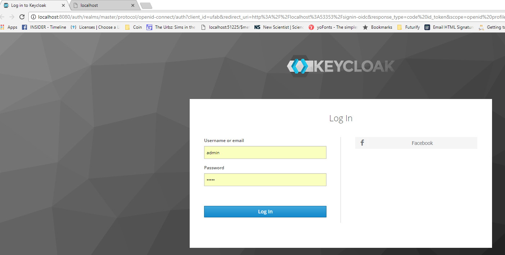
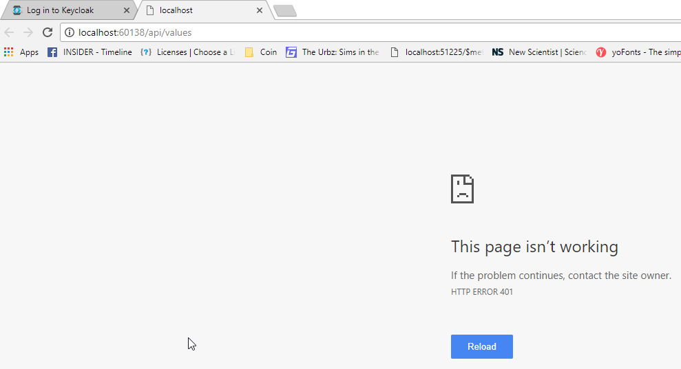

# Getting started
1. Install prerequisites
* [Docker](https://www.docker.com/community-edition#/download)
2. Run keycloak as Docker container
```Powershell
docker run --name keycloak  `
    -p 8080:8080    `
    -d  `
    -e KEYCLOAK_USER=admin -e KEYCLOAK_PASSWORD=admin   `
    jboss/keycloak
```
3. After awhile, keycloak server is ready at: http://localhost:8080/auth/
4. Click `Administrator Console`. Login using the credential from step 2
5. Import `realm-ufab.json`. The file imports the following resources:

Resource type | Resource | Properties
--- | --- | ---
Client | ufab | Access Type = Public
Identity Provider | facebook | 

6. Run the solution. You would see 2 web apps:
* MVC web app: http://localhost:53353/
* Web API app: http://localhost:60138/
Try run those apps in browser that you haven't yet login to keycloak
Because both apps are protected by keycloak now. You would see that 
* MVC app is redirected to keycloak login page

* web api resource get 401 unauthorized


7. Now login and you now access the MVC app
8. You would see tab `Token` that shows the Identity Token of the user. You can use that token to access resource from web api app.
9. Other tab `Call Api` demos the use of the token to call the API app.

